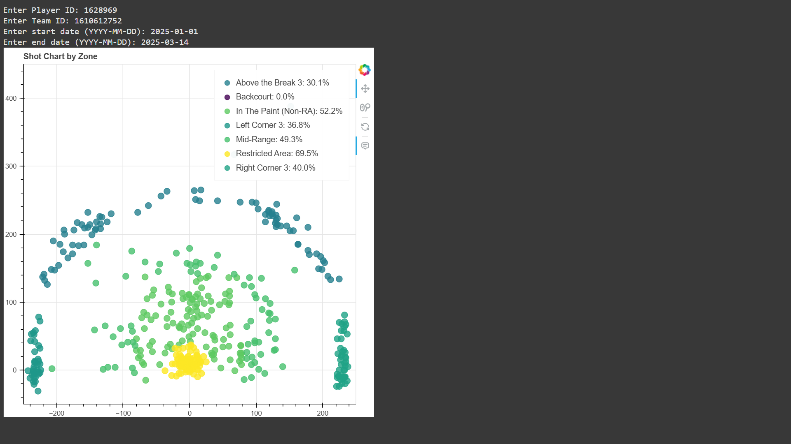
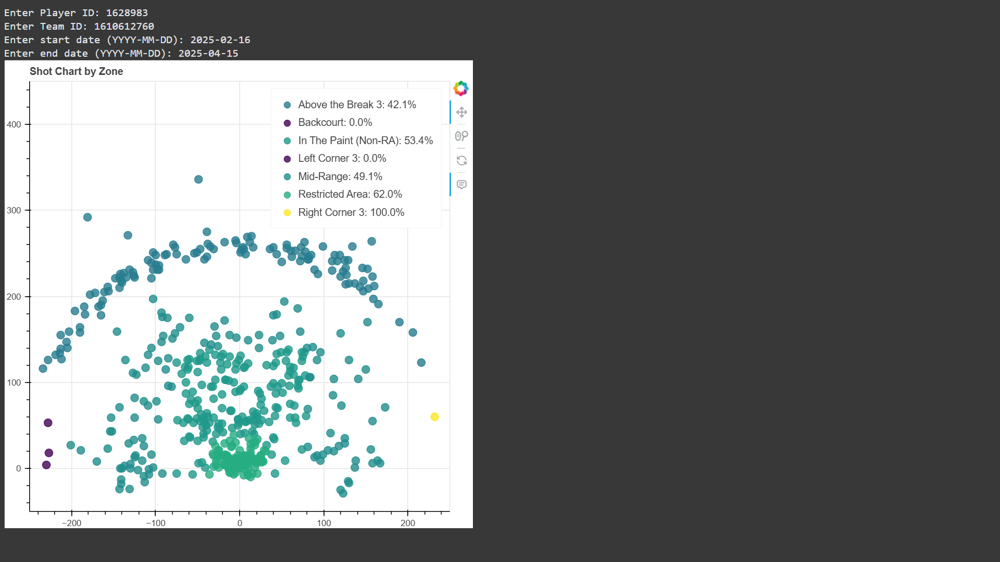

# NBA Player Comparison  

## Overview  
This project analyzes NBA players using visualizations to compare their career trajectories, shot diet, and more  

## Helpful Features Include
- Shot chart Generation, with date filter

 
- Team Stat ranking!
  
- Career Trajectory Calculation
- Player Defensive Position Efficiency 

## How to Run  
1. Clone the repository:  

